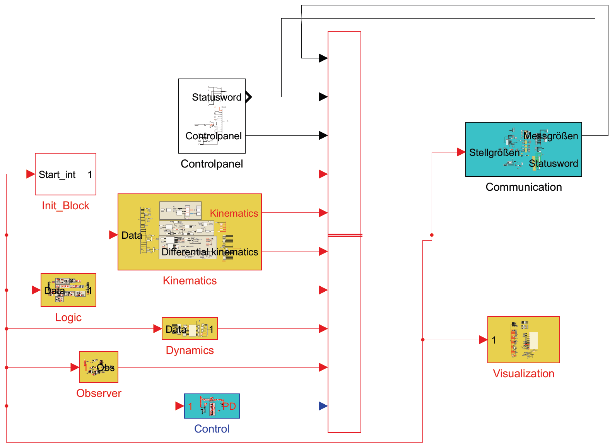
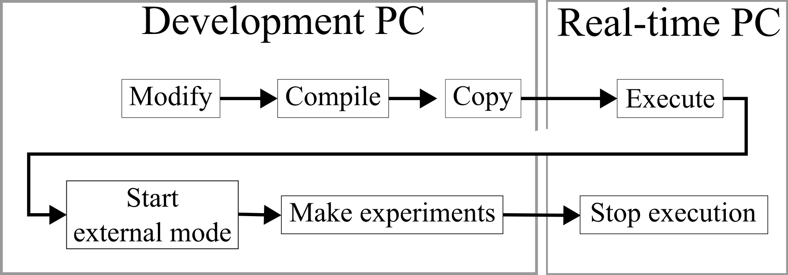

# Planar Parallel Robot
## Structure
The [repository](https://github.com/AranMoha/SafePR/tree/main/30_procedure_simulation/10_3RRR) of the planar parallel robot is structured as follows
- `catkin_ws`: ROS workspace
- `ros_rt_interface`: Real-time interface (in the Simulink model)
- `PR_Planar_Controlpanel.mlapp`: Graphical user interface to parameterize the simulink model
- `PR_Planar_Testbench_2018.mdl`: Simulink model
- `PR_Planar_Testbench_2018_Init.m`: Initialization script
- `build.sh`: Compile ROS workspace
- `build_dep_simulink.sh`: Build ROS real-time interface for Simulink
- `sync.sh`: Copy compiled model to real-time computer
- `Libraries`
  - `Contact`: weights for feedforward neural networks
  - `EtherCAT_ConfigSlaves`: Configuration files of the EtherLab slaves
  - `KinematicsandDynamics`: Kinematics and dynamics functions
  - `Trajectories`: Trajectory files
  - `mujoco_stl_xml_files`: STL files for MuJoCo
  - `simulink_custLib`: Simulink libraries

## Simulink model
This section provides an understanding of the Simulink model, which is used to operate the planar PR. The individual subsystems are described.

The figure shows the methodological procedure. Target poses are specified via a GUI, after which an acceleration-trapezoidal profile is planned. The target poses, velocities and accelerations are demanded incrementally by 1kHz. The detection, classification, localization, identification and reaction are also shown.

The figure shows the simulink model on the highest level to depict the signal flow diagram of the test bench.

- **Control panel**
  - The control panel (GUI) makes it possible to change parameters in the Simulink model at runtime. Since the model must be compiled before it is executed, the workspace is already predefined at program start and can no longer be changed. However, it is possible to subsequently change the memory allocated for individual parameters during compilation using the GUI. This means that only values can be changed at runtime, but not added.
-**Init_Block**
  - The subsystem contains a separate state machine for each motor. This is designed to ensure that the motors run through a predefined initialization protocol when they are switched on. If the *start_int* (enable drive from control panel) gets true (“Motor on/off” command set by the user), the initial state is exited. From now on, the real-time computer and servo controller exchange *statusword* and *controlword* in order to ultimately keep the motor switched on and ready for operation in the final state. Running through this state machine only takes a few cycles. If an error occurs, the *start_int* value is set to false and the motor switches off.
- **Kinematics**
  - In this subsystem, the measured variables of the active and passive joints for platform pose and speed are calculated. The end effector pose, velocity and acceleration are calculated here using the robot's direct and differential kinematics. The angles and velocities of the passive joints are also calculated.
- **Logic**
  - This subsystem is responsible for the entire logic. The trajectory planning for a point-to-point movement is calculated here and the trajectory files are also loaded. The output of this subsystem is the target pose, speed, acceleration in joint- and operational-space coordinates for reaction movements, as well as  parameters of the underlying state machine.
  - *State machine*
    - The state machine is controlled via user input in the GUI and can basically be divided into three branches for planned movements. The first strand controls the logic of a point-to-point movement with an acceleration trajectory profile, the second strand controls the logic of the movement to the home position and the third strand takes care of the correct execution of the trajectories. In principle, the course of the first and second strand is the same, which is why only the first and third are described in more detail below.
    - Two further states are there to prevent errors through safety functions. The following points are addressed with the safety functions:
      - Joint- and operational-space limits
      - Singularities of type I, II and III
      - Contact detection
      - Self-collision
      - NaN values from the generalized-momentum observer
    - The final branch with three states are only active if a contact is detected and a reaction is enabled by the user.
    - Another criterion checks the user input and is set by the state machine. If the user presses the *Terminate* button in the GUI during a movement execution and before the last target platform pose is reached, the target motor torques are zeroed and the motors are switched off.
- **Dynamics**
  - Here, the individual dynamic terms are calculated on the basis of the minimum dynamic parameters and the kinematic parameters. The dynamic terms from this system therefore describe the current actual state of the robot. The functions used in the model were first set up analytically using the symbolic calculation program Maple and then exported to Matlab code.
- **Observer**
  - This subsystem includes observers for estimating unmeasured variables such as external forces at the mobile platform.
  - In addition, the entire process from detection to classification, localization and isolation is implemented here.
- **Control**
  - This section contains the Cartesian impedance control and the code for the nullspace projection. In addition, the commanded motor torques are checked for plausibility (inf or nan).
- **Communication**
  - This subsystem contains the interface blocks of the EtherLab library. The outputs of the blocks are the current measured variables. In addition to position and torque, the 16-bit value Statusword is also output. This is generated by the control logic of the terminals and indicates the current status of the motors.
  - Each bit has its own meaning, which can be taken from the instructions for the respective terminal or the display in the higher-level system in Simulink.
  - The inputs of the interface block consist of the control word and a commanded variable. Which control value can be used depends on the current operating mode of the module. Position control, speed control and current control are possible on this test rig. By default, the robot is in the current-controlled state. Like the statusword, the controlword is a 16-bit value where each bit has its own meaning. The controlword gives the servo terminals control specifications such as “current on”, “motor on”, “brakes on”, “emergency off” etc. Further details can be found in the instructions for the terminal.
  - The measurement data received by the interface block is raw data. In this block, the measured variables are interpreted and converted into physical variables. Each variable is first converted into a double.

## Operating the test bench
### Requirements
- Matlab R2018b (tested with it, update to newer versions pending)
- RT-PC with EtherCAT ([SETUP_RTPC.MD](https://github.com/SchapplM/etherlab-examples/blob/master/SETUP_RTPC.MD) and [SETUP_ETHERCAT.MD](https://github.com/SchapplM/etherlab-examples/blob/master/SETUP_ETHERCAT.MD)).
- Dev-PC with EtherLab (also [SETUP_ETHERCAT.MD](https://github.com/SchapplM/etherlab-examples/blob/master/SETUP_ETHERCAT.MD))

Simulink in Matlab version 2018b is used to operate the planar parallel robot. Later versions must first be exported to the 2018b version in Simulink under *File->Export Model to->Previous Version*.
This section explains the test execution, the initialization script (``PR_Planar_Testbench_2018_Init.m``) and the post-processing script (``Read_Data.m``). The basic procedure is shown in the following illustration.

1. Dev-PC: Start Matlab and run ``PR_Planar_Testbench_2018_Init.m``. This sets paths, kinematic and dynamic parameters.
2. Dev-PC: Open, design and compile the Simulink model and copy it to the RT-PC       
  - Open ``PR_Planar_Testbench_2018.mdl``.
  - Open ``PR_Planar_Controlpanel.mlapp``. This starts the GUI to transfer target poses or controller parameterizations to the RT-PC.
  - Compile model with ``Ctrl+B``
3. Dev-PC: ``$ ./build.sh && ./sync.sh`` This copies the compilation to the real-time computer via an ssh connection.
4. Dev-PC: connect to RT-PC via ``$ ssh RTPC_ec`` and on RT-PC ``$ sudo /etc/init.d/ethercat start`` (start EtherCAT master)
5. RT-PC: run ``$ ~/app_interface/ros_install/scripts/autostart.sh && tmux attach-session -t app``
  - Note: Execution can be terminated by pressing ``Ctrl+C`` in the terminal.
6. Dev-PC: Start external mode and run the following steps in the GUI
    1. **Set Model Name**: This should contain the name (PR_Planar_Testbench_2018) of the Simulink file and confirm by clicking the button
    2. **Start**: The robot is in the default state (in the state machine) and is waiting for an input. In this state, in which the GUI is activated but the motors are still switched off, a trajectory can be loaded and control parameters of the controllers can be changed.
    3. **Reset Incr Encoder**: Inremental encoder values are compensated by the offsets
    4. **Enable Drive**: Switching on the motors via communication between host and target (controlword and statusword)
    5. You can now move to a target position by pressing **Go to Target** or the start position with **Home Pose** or a trajectory with **Trajectory**. If the robot behaves unplanned, the motor is switched off directly by pressing the **Terminate** button.
    6. As soon as the movement is complete, press **Terminate** and follow step 5 again.
    7. When all drives are finished, then **Terminate** (if not already done) --> **Disable Drive** --> **Stop** and end Simulink execution
6. After the experiment on RT-PC: ``Ctrl+C`` in tmux windows, ``$ tmux kill-session`` and ``$ sudo /etc/init.d/ethercat stop`` to stop the EtherCAT master
7. Dev-PC: Postprocessing via ``postprocess.m`` (saves recorded data in single file: ``measurements_struct.mat``)

## Operating the simulation
1. Execute the script `PR_Planar_Testbench_2018_Init.m`. The MuJoCo animation of the PR should appear
2. Open the simulink model `PR_Planar_Testbench_2018.mdl`
3. Open the GUI `PR_Planar_Controlpanel.mlapp`
4. Execute the simulink model `PR_Planar_Testbench_2018.mdl`
5. Execute the GUI via the following steps
    1. **Set Model Name**: This should contain the name of the Simulink file and confirm by clicking the button
    2. **Start**: The robot is in the default state (in the state machine) and is waiting for an input. In this state, in which the GUI is activated but the motors are still switched off, a trajectory can be loaded and control parameters of the controllers can be changed.
    3. **Enable Drive** and then **Set Statuswort**: Switching on the motors and simulated communication between host and target via status word and control word
    4. You can now move to a target position by pressing **Go to Target** or the start position with **Home Pose** or a trajectory with **Trajectory**. The robot in the MuJoCo animation should move. If the robot behaves unplanned, the motor is switched off directly by pressing the **Terminate** button.
    5. As soon as the movement is complete, press **Terminate** and follow step 4 again.
    6. When all drives are finished, then **Terminate** (if not already done) --> **Disable Drive** --> **Stop** and end Simulink execution

## Required toolboxes
The following toolboxes must be installed:
- Communications Toolbox
- Control System Toolbox
- Deep Learning Toolbox
- DSP System Toolbox
- Global Optimization Toolbox
- Image Processing Toolbox
- MATLAB Coder
- Matlab Support for MinGW-w64 C/C++ Compiler
- Optimization Toolbox
- Parallel Computing Toolbox
- Robotics System Toolbox
- Signal Processing Toolbox
- Simulink
- Simulink Coder
- Simulink Real-Time
- Simulink Real-Time Target Support Package
- Stateflow
- Statistics and Machine Learning Toolbox
- Symbolic Math Toolbox
- System Identification Toolbox
