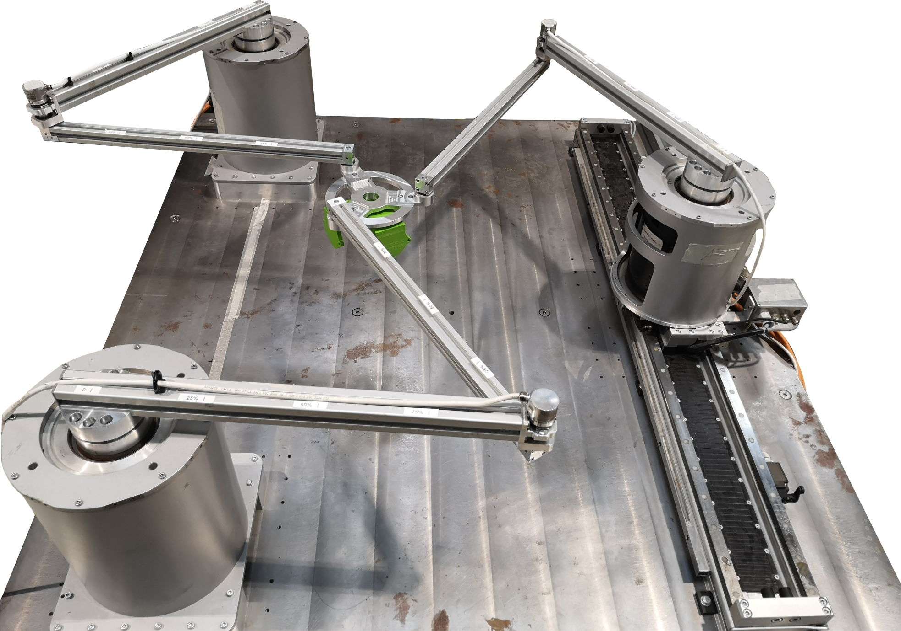

# Planar Parallel Robot

Bedienung der planaren PKM in der MuJoCo-Simulation und des realen Versuchsstands.
Wenn ein Punkt hier fehlt/falsch ist, dann bitte eine Mail an die untenstehende Adresse.
Aran Mohammad, aran.mohammad@imes.uni-hannover.de

## Repostruktur

Das Repo gliedert sich wie folgt:

- `GeomagicTouch`:  Software für die Einbindung des GeomagicTouch
- `Koordinatensysteme`:  Koordinatensysteme jedes Freiheitsgrads der PKM als Matlab-Figures
- `MuJoCo`:  Dynamiksimulation mit Animation in MuJoCo
- `3RRR.mw`: Maple-Datei für symbolische Rechensoftware für Kinematik-, Dynamikmodellierung
- `Versuchsstand`:  Matlab-Code zur Bedienung der PKM und Nachbearbeitung von Daten
  - `Bibliotheken`
    - `Auswertung`: Auswertungsskripte von Daten
    - `EtherCAT_ConfigSlaves`: Konfigurationsdateien der Etherlab-Slaves
    - `Identifikation`: Identifikation der Dynamikparameter
    - `KinematikundDynamik`: Kinematik- und Dynamikfunktionen
    - `Kontakt`: Kontaktmodellierung
    - `mujoco_stl_xml_files`: STL-Dateien für MuJoCo
    - `mujoco210`: MuJoCo Rechensoftware
    - `Plots`
    - `Postprocessing`: Skripte für Nachbearbeitung
    - `simulink_custLib`: Simulink-Bibliotheken
    - `Trajektorien`: Trajektorienmat-Dateien
  - `Planar_Kin_Controlpanel.mlapp`: GUI zur Bedienung der PKM
  - `PKM_3PRRR_Versuchsstand_Init.m`: Initialisierungsskript
  - `PKM_Planar_Versuchsstand_2018.slx`: Simulinkmodell zur Bedienung der PKM
  - `PKM_Planar_Versuchsstand_SensorenAuslesen_2018.slx`: Simulinkmodell zum Auslesen der Sensoren
  - `PKM_Planar_Versuchsstand_SingleAxis_2018.slx`: Simulinkmodell zur Bedienung einer einzelnen Achse

- `Dokumentation zum Simulinkmodell des Delta.docx`

## Bedienung der Simulation

Zum Starten der MuJoCo-Simulation sind folgende Schritte nötig:

1. Führe das Skript `Versuchsstand/PKM_3PRRR_Versuchsstand_Init.m` aus. Die MuJoCo-Animation der PKM sollte erscheinen
2. Falls das Betriebssystem ein anderes als Windows ist, müssen die notwendigen **.mex** Dateien für Matlab generiert werden. Hierzu muss die Datei **Bibliotheken/mujoco210/mjxmake.m** in Matlab ausgeführt werden. Vorher müssen jedoch noch die Dateipfade in dieser Datei angepasst werden.
3. Öffne die GUI `Versuchsstand/Planar_Kin_Controlpanel.mlapp`
4. Öffne das Simulink-Modell `Matlab/PKM_Planar_Versuchsstand_2018.slx`
5. Führe das Simulink-Modell `Matlab/PKM_Planar_Versuchsstand_2018.slx`aus
6. In der GUI folgende Eingaben tätigen
    1. **Set Model Name**: Hierin sollte der Name der Simulink-Datei stehen und mit Klick des Buttons bestätigen
    2. **Start**: Der Roboter ist im Default-Zustand (im Zustandsautomaten) und wartet auf eine Eingabge. In diesem Zustand, in der die GUI aktiviert ist, aber die Motoren noch ausgeschaltet sind, kann eine Trajektorie geladen werden und es können Regelparameter des Impedanzreglers verändert werden.
    3. **Enable Drive** und dann **Set Statuswort**: Anschalten der Motoren und simulierte Kommunikation zwischen Master und Slave über Statuswort und Controlword
    4. Jetzt kann eine Zielposition (bestenfalls in Arbeitsraumkoordinaten) mit Betätigung von **Zielposition EE** oder die Startstellung mit **Homeposition** oder eine Trajektorie mit **Trajektorie** gefahren werden. Der Roboter in der MuJoCo-Animation sollte sich bewegen. Verhält sich der Roboter unplanmäßig, wird durch Betätigung des Abbrechen Knopfes der Motor direkt ausgeschaltet.
    5. Sobald die Fahrt fertig ist, dann **Abbrechen** betätigen und wieder Schritt 5 befolgen.
    6. Wenn alle Fahrten fertig sind, dann **Abbrechen** (falls noch nicht geschehen) --> **Disable Drive** --> **Stop** und Simulink-Ausführung beenden

## Toolboxen
Folgende Toolboxen müssen installiert sein:
- Communications Toolbox
- Control System Toolbox
- Deep Learning Toolbox
- DSP System Toolbox
- Global Optimization Toolbox
- Image Processing Toolbox
- MATLAB Coder
- Matlab Support for MinGW-w64 C/C++ Compiler
- Optimization Toolbox
- Parallel Computing Toolbox
- Robotics System Toolbox
- Signal Processing Toolbox
- Simulink
- Simulink Coder
- Simulink Real-Time
- Simulink Real-Time Target Support Package
- Stateflow
- Statistics and Machine Learning Toolbox
- Symbolic Math Toolbox
- System Identification Toolbox

## Sonstiges

- Simulink-Version ist in Matlab 2018b
- Weitere Informationen zum Simulink-Modell, zur Aktorik/Sensorik oder Bedienung am Versuchsstand sind unter: https://wiki.projekt.uni-hannover.de/imes-projekt-dfg_mrkpkm/start?do=login --> Versuchsstände/Planare PKM
