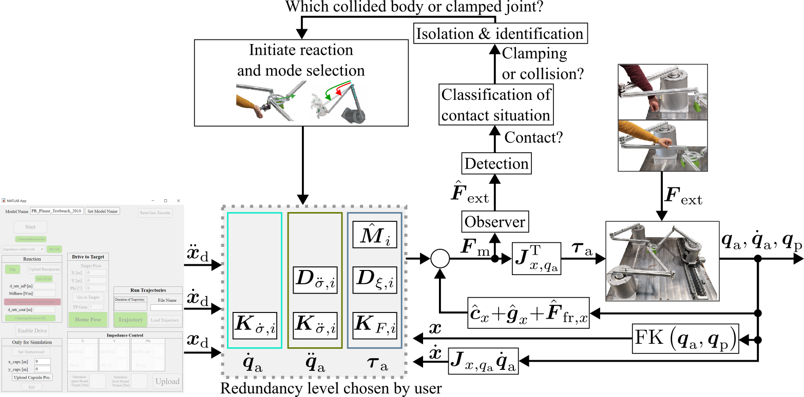

# Planar Parallel Robot
## Structure
The [repository](https://github.com/AranMoha/SafePR/tree/main/30_procedure_simulation/10_3RRR) of the planar parallel robot is structured as follows
- `catkin_ws`: ROS workspace
- `ros_rt_interface`: Real-time interface (in the Simulink model)
- `PR_Planar_Controlpanel.mlapp`: Graphical user interface to parameterize the simulink model
- `PR_Planar_Testbench_2018.mdl`: Simulink model
- `PR_Planar_Testbench_2018_Init.m`: Initialization script
- `build.sh`: Compile ROS workspace
- `build_dep_simulink.sh`: Build ROS real-time interface for Simulink
- `sync.sh`: Copy compiled model to real-time computer
- `Libraries`
  - `Contact`: weights for feedforward neural networks
  - `EtherCAT_ConfigSlaves`: Configuration files of the EtherLab slaves
  - `KinematicsandDynamics`: Kinematics and dynamics functions
  - `Trajectories`: Trajectory files
  - `mujoco_stl_xml_files`: STL files for MuJoCo
  - `simulink_custLib`: Simulink libraries

## Simulink model
This section provides an understanding of the Simulink model, which is used to operate the planar PR. The individual subsystems are described.

The figure shows the principle procedure and signal flow diagram of the test bench. Target poses are specified via a GUI, after which an acceleration-trapezoidal profile is planned. The target poses, velocities and accelerations are demanded incrementally by 1kHz. The detection, classification, localization, identification and reaction are also shown.

### Control panel
The control panel (GUI) makes it possible to change parameters in the Simulink model at runtime. Since the model must be compiled before it is executed, the workspace is already predefined at program start and can no longer be changed. However, it is possible to subsequently change the memory allocated for individual parameters during compilation using the GUI. This means that only values can be changed at runtime, but not added.
### Init_Block
The **Init_Block** subsystem contains a separate state machine for each motor. This is designed to ensure that the motors run through a predefined initialization protocol when they are switched on. If the *start_int* (enable drive from control panel) gets true (“Motor on/off” command set by the user), the initial state is exited. From now on, the real-time computer and servo controller exchange *statusword* and *controlword* in order to ultimately keep the motor switched on and ready for operation in the final state. Running through this state machine only takes a few cycles. If an error occurs, the *start_int* value is set to false and the motor switches off.

### Kinematics
In this subsystem, the measured variables of the active and passive joints for platform pose and speed are calculated. The end effector pose, velocity and acceleration are calculated here using the robot's direct and differential kinematics. The angles and velocities of the passive joints are also calculated.

### Logic
This subsystem is responsible for the entire logic. The trajectory planning for a point-to-point movement is calculated here and the trajectory files are also loaded. The output of this subsystem is the target pose, speed, acceleration in joint- and operational-space coordinates for reaction movements, as well as  parameters of the underlying state machine.

### Dynamics
### Observer
### Control

## Operating the simulation
1. Execute the script `PR_Planar_Testbench_2018_Init.m`. The MuJoCo animation of the PR should appear
2. Open the simulink model `PR_Planar_Testbench_2018.mdl`
3. Open the GUI `PR_Planar_Controlpanel.mlapp`
4. Execute the simulink model `PR_Planar_Testbench_2018.mdl`
5. Execute the GUI via the following steps
    1. **Set Model Name**: This should contain the name of the Simulink file and confirm by clicking the button
    2. **Start**: The robot is in the default state (in the state machine) and is waiting for an input. In this state, in which the GUI is activated but the motors are still switched off, a trajectory can be loaded and control parameters of the controllers can be changed.
    3. **Enable Drive** and then **Set Statuswort**: Switching on the motors and simulated communication between host and target via status word and control word
    4. You can now move to a target position by pressing **Go to Target** or the start position with **Home Pose** or a trajectory with **Trajectory**. The robot in the MuJoCo animation should move. If the robot behaves unplanned, the motor is switched off directly by pressing the **Terminate** button.
    5. As soon as the movement is complete, press **Terminate** and follow step 4 again.
    6. When all drives are finished, then **Terminate** (if not already done) --> **Disable Drive** --> **Stop** and end Simulink execution

## Required toolboxes
The following toolboxes must be installed:
- Communications Toolbox
- Control System Toolbox
- Deep Learning Toolbox
- DSP System Toolbox
- Global Optimization Toolbox
- Image Processing Toolbox
- MATLAB Coder
- Matlab Support for MinGW-w64 C/C++ Compiler
- Optimization Toolbox
- Parallel Computing Toolbox
- Robotics System Toolbox
- Signal Processing Toolbox
- Simulink
- Simulink Coder
- Simulink Real-Time
- Simulink Real-Time Target Support Package
- Stateflow
- Statistics and Machine Learning Toolbox
- Symbolic Math Toolbox
- System Identification Toolbox
