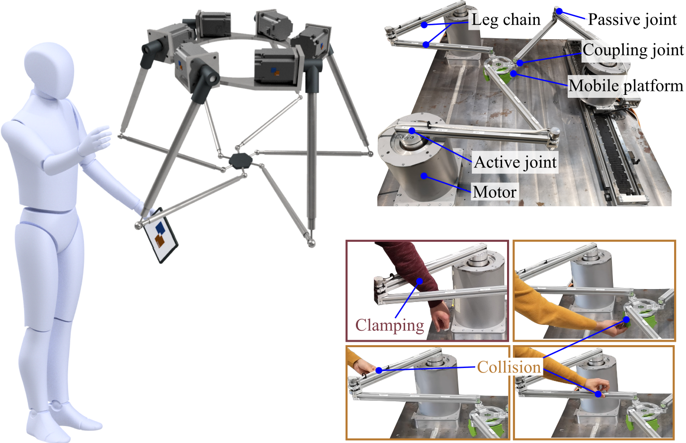

<p align="center">

</p>

# Welcome to the documentation of SafePR!

SafePR is an unified approach for **safe** **p**arallel **r**obot for physical human-robot interaction that is being developed at the Leibniz University Hannover by the [Institute of Mechatronic Systems](https://www.imes.uni-hannover.de/en/).

## Why SafePR?
This pages' motivation is twofold.

Firstly, Fast and safe motion is crucial for the long-term successful deployment of physically interactive robots.
Parallel robots offer the potential for higher speeds while maintaining the same energy limits due to their low moving masses.
However, they require methods for contact detection and reaction in high-speed scenarios for safe interaction.
In the work linked below, we address this issue and present **an unified approach**, termed as SafePR, for **detection**, **type-distinguishing**, as well as **localizing** the contacts to perform a **reaction** that is safe for humans and feasible for parallel robot.
The corresponding code can be found and described here to give other researchers the opportunity to use and further develop it.

Secondly, the **commissioning of custom-built robot systems** is very complex and many works already use commercially available systems that do not (or cannot) always allow full access to real-time signals such as joint torques. For these reasons, the complete **Simulink model of the SafePR algorithm** can also be found here.
This includes not only the algorithmic integration of the contact detection and reaction methods, but also the implementation of the logic to control a mechatronic system in a robust and repeatable manner.

**In the left column**, further information can be found regarding the Simulink model for the simulation as well as the execution of experiments on the test bench.
In addition, the core ideas of the individual steps of SafePR are described.

## Video
TBD

## Citing
A preprint of the paper is freely available via arXiv. If you use parts of this project for your research, please cite the following publication:
```
SafePR: A Unified Approach for Safe Parallel Robots by Contact Detection and Reaction with Redundancy Resolution
A. Mohammad, T.-L. Habich, T. Seel and M. Schappler
TBD
DOI: TBD
```
## Further Publications
- [Towards Human-Robot Collaboration with Parallel Robots by Kinetostatic Analysis, Impedance Control and Contact Detection (IEEE ICRA 2023)](https://arxiv.org/abs/2308.09633)
- [Collision Isolation and Identification Using Proprioceptive Sensing for Parallel Robots to Enable Human-Robot Collaboration (IEEE/RSJ IROS 2023)](https://arxiv.org/abs/2308.09650)
- [Safe Collision and Clamping Reaction for Parallel Robots During Human-Robot Collaboration (IEEE/RSJ IROS 2023)](https://arxiv.org/abs/2308.09656)
- [Quantifying Uncertainties of Contact Classifications in a Human-Robot Collaboration with Parallel Robots (HFR 2023)](https://arxiv.org/abs/2308.09675)
- [Towards Optimized Parallel Robots for Human-Robot Collaboration by Combined Structural and Dimensional Synthesis (VDIM 2024)](https://arxiv.org/abs/2408.15831)
- Stay tuned for more!

## Authors
SafePR is part of the PhD thesis of [Aran Mohammad](https://www.imes.uni-hannover.de/en/institute/team/m-sc-aran-mohammad) (Email: <aran.mohammad@imes.uni-hannover.de>) and was developed with support from colleagues (Moritz Schappler, Tim-Lukas Habich, Jan Piosik, Thomas Seel).
