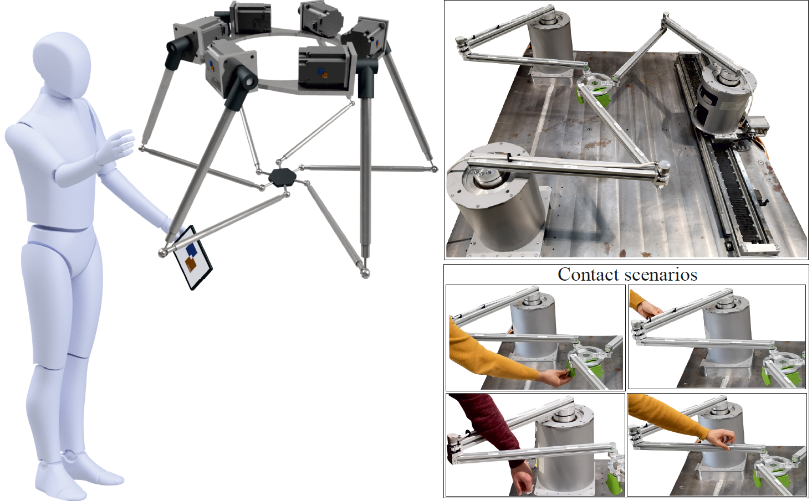

<p align="center">

</p>

# Welcome to the documentation of SafePR!

SafePR is an unified approach for **safe** **p**arallel **r**obot for physical human-robot interaction that is being developed at the Leibniz University Hannover by the [Institute of Mechatronic Systems](https://www.imes.uni-hannover.de/en/).

## Why SafePR?
Die Motivation dieses pages sind zwei Punkte.

Erstens, Fast and safe motion is crucial for the long-term successful deployment of physically interactive robots.
Parallel robots offer the potential for higher speeds while maintaining the same energy limits due to their low moving masses.
In der unten genannten Arbeit, we address this issue and present an unified approach, termed as SafePR, for detection, type-distinguishing, as well as localizing the contacts to perform a reaction that is safe for humans and feasible for parallel robot.
Der dazugehörige Code ist hier zu finden und beschrieben, um andere Forschende die Mgölcihkeit der Nutzung und Weiterentwicklung zu geben.

Zweitens, ist die Inbetriebnahme von eigens gebauten Robotersystemen sehr aufwändig und in vielen Arbeiten werden bereits kommerziell erhältliche Systeme verwendet, die nicht immer einen vollständigen Zugriff auf Echtzeit-Signale, wie Gelenkmomente, zulassen (können). Aus diesen Gründen ist hier auch das vollständige Simulink-Modell des SafePR-Agorithmus zu finden.
Darin ist nicht nur die algorithmische Verzahnung der Kontakterkennungs- und reaktionsmethoden, sondern auch die Implementierung der Logik, um ein mechatronisches System robust und wiederholbar zu steuern.


## Video

## Citing
The paper is freely available via arXiv. If you use parts of this project for your research, please cite the following publication:
```
SPONGE: SafePR - Unified Approach for Safe Parallel Robots: Contact Detection and Reaction with Redundancy Resolution
A. Mohammad, T.-L. Habich, T. Seel and M. Schappler
IEEE Transactions on Robotics (TRO) 2025
DOI: TBD
```
## Further Publications
- [Towards Human-Robot Collaboration with Parallel Robots by Kinetostatic Analysis, Impedance Control and Contact Detection (IEEE ICRA 2023)](https://arxiv.org/abs/2308.09633)
- [Collision Isolation and Identification Using Proprioceptive Sensing for Parallel Robots to Enable Human-Robot Collaboration (IEEE/RSJ IROS 2023)](https://arxiv.org/abs/2308.09650)
- [Safe Collision and Clamping Reaction for Parallel Robots During Human-Robot Collaboration (IEEE/RSJ IROS 2023)](https://arxiv.org/abs/2308.09656)
- [Quantifying Uncertainties of Contact Classifications in a Human-Robot Collaboration with Parallel Robots (HFR 2023)](https://arxiv.org/abs/2308.09675)
- [Towards Optimized Parallel Robots for Human-Robot Collaboration by Combined Structural and Dimensional Synthesis (VDIM 2024)](https://arxiv.org/abs/2408.15831)
- Stay tuned for more!

## Authors
SafePR is part of the PhD thesis of [Aran Mohammad](https://www.imes.uni-hannover.de/en/institute/team/m-sc-aran-mohammad) (Email: <aran.mohammad@imes.uni-hannover.de>) and was developed with support from colleagues (Moritz Schappler, Tim-Lukas Habich, Jan Piosik, Thomas Seel).
